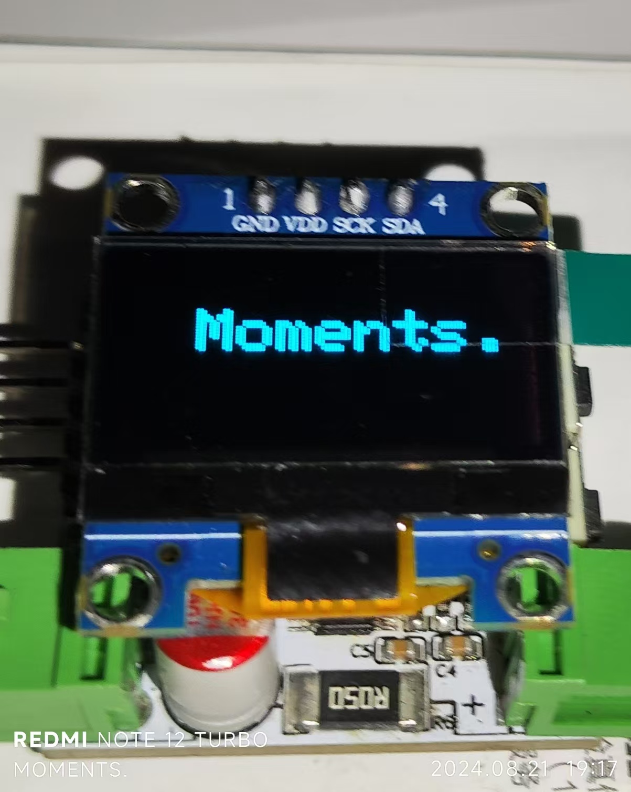
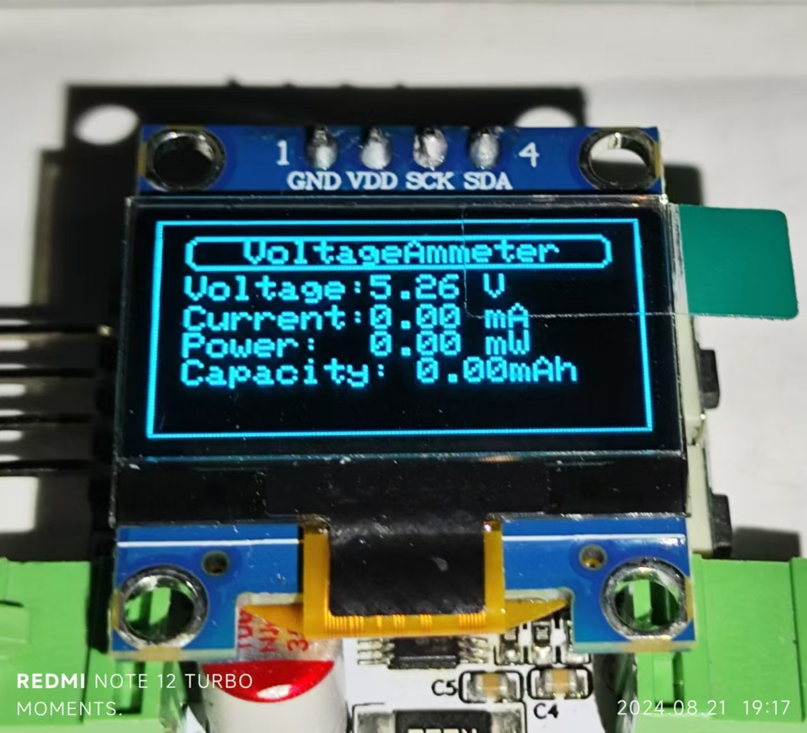

# 基于AIR001+INA226的功率计

主控采用AIR001
~~（不过这玩意貌似绝版了考虑换新的mcu了）~~

电流电压采样芯片采样 INA226芯片

程序框架采用Arduino
~~,什么方便调库~~

### 输入参数分别为

输入电压最低3.3V最高30V

输入电流最大8A

可在屏幕上显示电压电流参数，并计算显示出功率，

以及计算出流过的电流对时间的积分，也就是可以配合负载用来测量电池容量之类的

工作时按boot按钮可以清零Capacity的值

每当流过电荷量为25C时，板载的LED会闪烁一次

### 烧录方式
同时按住RST和BOOT按钮，先松开RST后松开BOOT然后点击烧录